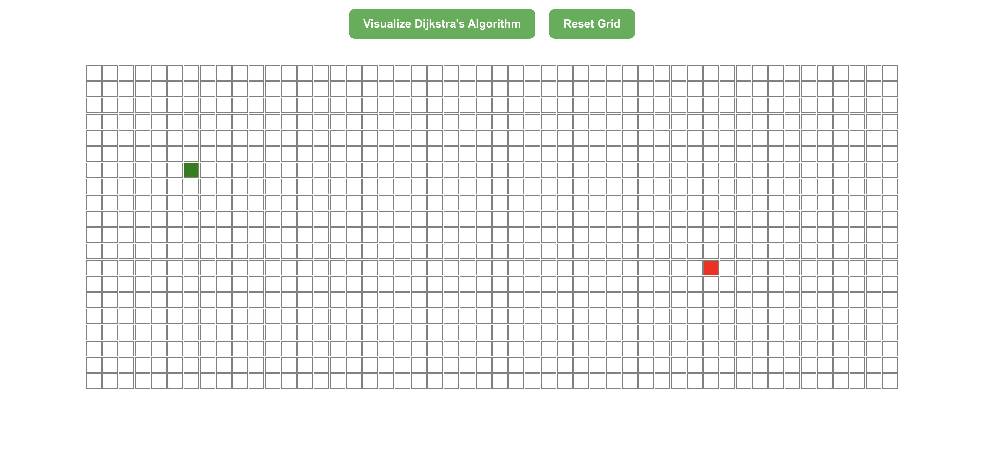
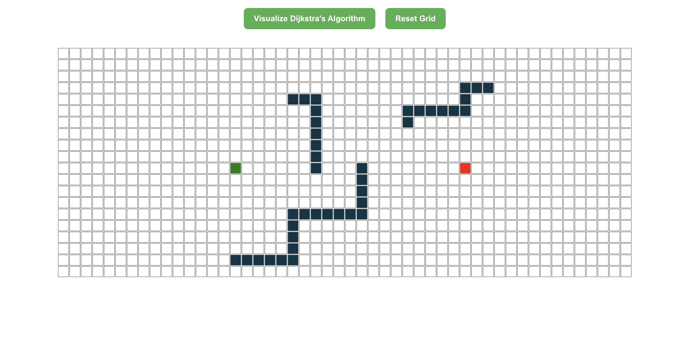
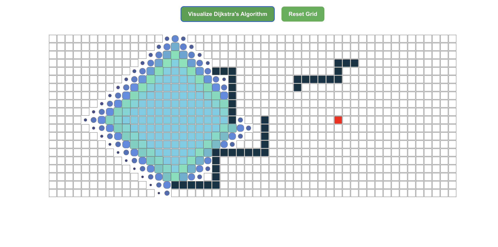
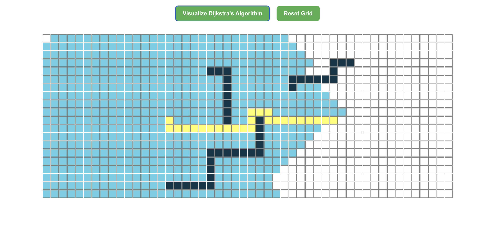

# 🧭 FindMyWay

An interactive and visual tool to understand and explore **Dijkstra’s Algorithm**. Build and customize a grid, set walls, and watch the algorithm find the shortest path from start to finish in real time.

---

## 🚀 Features

- Visualize **Dijkstra's Algorithm**
- Click to create **walls** and **obstacles**
- Set **start** and **end** points
- Clean and responsive **React UI**
- Easy to use for beginners and students

---

## 🛠 Tech Stack

- **React.js**
- **JavaScript (ES6)**
- **HTML & CSS**

---

## 🖥️ Pictures

### Start and Finish Node


---

### Walls


---

### Animation


---

### Shortest Path



---

## 🔹 Installation

```bash
git clone https://github.com/donna1356/FindMyWay.git
cd FindMyWay
npx create-react-app my-app .
npm start
```

---

## Author

Dona Banerjee — [@donna1356](https://github.com/donna1356)

---

Feel free to contribute, suggest features, or report issues!
